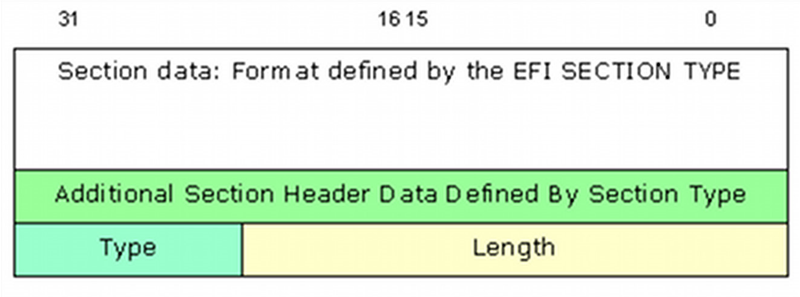
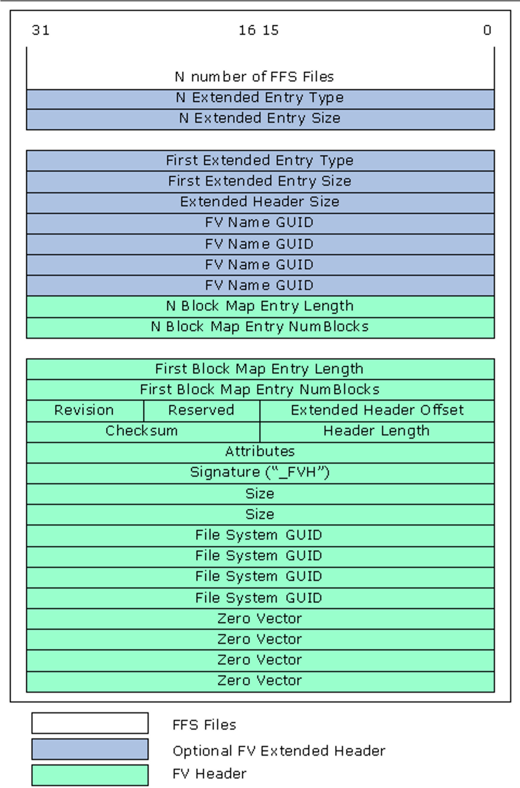

<!--- @file
  2.5 Generic Build Process

  Copyright (c) 2008-2017, Intel Corporation. All rights reserved. 

  Redistribution and use in source (original document form) and 'compiled'
  forms (converted to PDF, epub, HTML and other formats) with or without
  modification, are permitted provided that the following conditions are met:

  1) Redistributions of source code (original document form) must retain the
     above copyright notice, this list of conditions and the following
     disclaimer as the first lines of this file unmodified.

  2) Redistributions in compiled form (transformed to other DTDs, converted to
     PDF, epub, HTML and other formats) must reproduce the above copyright
     notice, this list of conditions and the following disclaimer in the
     documentation and/or other materials provided with the distribution.

  THIS DOCUMENTATION IS PROVIDED BY TIANOCORE PROJECT "AS IS" AND ANY EXPRESS OR
  IMPLIED WARRANTIES, INCLUDING, BUT NOT LIMITED TO, THE IMPLIED WARRANTIES OF
  MERCHANTABILITY AND FITNESS FOR A PARTICULAR PURPOSE ARE DISCLAIMED. IN NO
  EVENT SHALL TIANOCORE PROJECT  BE LIABLE FOR ANY DIRECT, INDIRECT, INCIDENTAL,
  SPECIAL, EXEMPLARY, OR CONSEQUENTIAL DAMAGES (INCLUDING, BUT NOT LIMITED TO,
  PROCUREMENT OF SUBSTITUTE GOODS OR SERVICES; LOSS OF USE, DATA, OR PROFITS;
  OR BUSINESS INTERRUPTION) HOWEVER CAUSED AND ON ANY THEORY OF LIABILITY,
  WHETHER IN CONTRACT, STRICT LIABILITY, OR TORT (INCLUDING NEGLIGENCE OR
  OTHERWISE) ARISING IN ANY WAY OUT OF THE USE OF THIS DOCUMENTATION, EVEN IF
  ADVISED OF THE POSSIBILITY OF SUCH DAMAGE.

-->

## 2.5 Generic Build Process

All code starts out as either C sources and header files, assembly sources and
header files, UCS-2 HII strings in Unicode files, Virtual Forms Representation
files or binary data (native instructions, such as microcode) files. Per the
UEFI and PI specifications, the C and Assembly files must be compiled and
linked into PE32/PE32+ images.

While some code is designed to execute only from ROM, most UEFI/PI modules are
written to be relocate-able. These are written and built different. For
example, Execute In Place (XIP) module code is written and compiled to run from
ROM, while the majority of the code is written and compiled to execute from
memory, which requires that the code be relocate able.

Some modules may also permit dual mode, where it will execute from memory only
if memory is available, otherwise it will execute from ROM. Additionally,
modules may permit dual access, such as a driver that contains both PEI and DXE
implementation code. Code is assembled or compiled, then linked into PE32/PE32+
images, the relocation section may or may not be stripped and an appropriate
header will replace the PE32/PE32+ header. Additional processing may remove
more non-essential information, generating a Terse (TE) image.

The binary executables are converted into EFI firmware file sections. Each
module is converted into an EFI Section consisting of an Section header
followed by the section data (driver binary).

### 2.5.1 EFI SECTION Files

The general section format for sections less than 16MB in size is shown in
Figure 7. Figure 8 shows the section format for sections 16MB or larger in
size using the extended length field.

###### Figure 7 General EFI Section Format (< 16MB)

###### Figure 8 General EFI Section Format for Large Size Sections.

Table 2 below lists the different architecturally defined section types,
refer to the _PI Specification_, Volume 3 for additional details.

###### Table 2 EFI Section Types

| Name                                | Description                                                                         |
| ----------------------------------- | ----------------------------------------------------------------------------------- |
| `EFI_SECTION_COMPRESSION`           | Encapsulation section where other sections are compressed                           |
| `EFI_SECTION_GUID_DEFINED`          | Encapsulation section where other sections have a format defined by a GUID.         |
| `EFI_SECTION_DISPOSABLE`            | Encapsulation section used during the build process but not required for execution. |
| `EFI_SECTION_PE32`                  | PE32+ Executable Image                                                              |
| `EFI_SECTION_PIC`                   | Position-Independent Code.                                                          |
| `EFI_SECTION_TE`                    | Terse Executable image.                                                             |
| `EFI_SECTION_DXE_DEPEX`             | DXE Dependency Expression.                                                          |
| `EFI_SECTION_VERSION`               | Version, Text and Numeric (UNICODE)                                                 |
| `EFI_SECTION_SMM_DEPEX`             | Leaf section type for determining the dispatch order for an SMM driver.             |
| `EFI_SECTION_USER_INTERFACE`        | User-Friendly name of the driver (UNICODE)                                          |
| `EFI_SECTION_COMPATIBILITY16`       | DOS-style 16-bit executable.                                                        |
| `EFI_SECTION_FIRMWARE_VOLUME_IMAGE` | PI Firmware Volume Image.                                                           |
| `EFI_SECTION_FREEFORM_SUBTYPE_GUID` | Raw data with GUID in header to define format.                                      |
| `EFI_SECTION_RAW`                   | Raw data (for example, a logo).                                                     |
| `EFI_SECTION_PEI_DEPEX`             | PEI Dependency Expression.                                                          |

### 2.5.2 Firmware Files

Multiple EFI Sections are combined into a Firmware file (FFS) which consists of
zero or more EFI sections. Each FFS consists of a FFS header plus the data.
Figure 9 show the basic FFS File layout and Figure 10 shows the FFS File
layout for files of 16MB or larger.

###### Figure 9 Typical FFS File Layout (<16MB)

###### Figure 10 File Header 2 layout for files larger than 16Mb

Table 3 lists the different FV file types architecturally defined in the
_PI Specification_ describing the content (FFS) of the Firmware Volume Data.

###### Table 3 Defined FV File Types

| Name                                    | Description                                                                                            | Code       |
| --------------------------------------- | ------------------------------------------------------------------------------------------------------ |:----------:|
| `EFI_FV_FILETYPE_RAW`                   | Binary data.                                                                                           | 0x01       |
| `EFI_FV_FILETYPE_FREEFORM`              | Sectioned Data.                                                                                        | 0x02       |
| `EFI_FV_FILETYPE_SECURITY_CORE`         | Platform core code used during the SEC phase.                                                          | 0x03       |
| `EFI_FV_FILETYPE_PEI_CORE`              | PEI Foundation code.                                                                                   | 0x04       |
| `EFI_FV_FILETYPE_DXE_CORE`              | DXE Foundation code.                                                                                   | 0x05       |
| `EFI_FV_FILETYPE_PEIM`                  | PEI Module (PEIM)                                                                                      | 0x06       |
| `EFI_FV_FILETYPE_DRIVER`                | DXE driver.                                                                                            | 0x07       |
| `EFI_FV_FILETYPE_COMBINED_PEIM_DRIVER`  | Combined PEIM/DXE driver                                                                               | 0x08       |
| `EFI_FV_FILETYPE_APPLICATION`           | Application                                                                                            | 0x09       |
| `EFI_FV_FILETYPE_SMM`                   | Contains a PE32+ image that will be loaded into SMRAM.                                                 | 0x0A       |
| `EFI_FV_FILETYPE_FIRMWARE_VOLUME_IMAGE` | An embedded Firmware Volume Image.                                                                     | 0x0B       |
| `EFI_FV_FILETYPE_COMBINED_SMM_DXE`      | Contains PE32+ image that will be dispatched by the DXE Dispatcher and will also be loaded into SMRAM. | 0x0C       |
| `EFI_FV_FILETYPE_SMM_CORE`              | SMM Foundation                                                                                         | 0x0D       |
| `EFI_FV_FILETYPE_OEM_*`                 | OEM File Types                                                                                         | 0xC0..0xDF |
| `EFI_FV_FILETYPE_DEBUG_*`               | Debug/Test File Types                                                                                  | 0xE0..0xEF |
| `EFI_FV_FILETYPE_FFS_*`                 | Firmware File System Specific File Types                                                               | 0xF0..0xFF |
| `EFI_FV_FILETYPE_FFS_PAD`               | Pad file for FFS.                                                                                      | 0xF0       |

### 2.5.3 Firmware Volumes

One or more FFS files are combined into a Firmware Volume (FV). The format for
an FV is a header followed by an optional extended header, followed by zero or
more FFS files. Figure 11 illustrates the layout of the FV.

###### Figure 11 General FV Layout

Multiple FV files, each of which is just a logical firmware device, can be
combined into a single FD image.

Within the context of modules, error messages within the code are written in
plain text (English - ASCII) while messages that are displayed as part of the
menu system or are stored for display later, are written in Unicode (UCS2-LE
encoded) format. The UEFI/PI specifications define the structure for Human
Interface Infrastructure (HII) as well as Visual Forms Representation (VFR).
Vital Product Data (VPD) areas are also supported. The VPD format is unique to
a platform implementation, and not defined by any specification. The EDK II
build system does provide tools to generate VPD binary data files and text
based map files that show the layout of the VPD PCDs.

### 2.5.4 Special Files - VTF & BSF

The Volume Top File (VTF) is a file that must be located such that the last
byte of the file is also the last byte of the firmware volume. Regardless of
the actual file type, a VTF file must have the file name GUID of
`EFI_FFS_VOLUME_TOP_FILE_GUID`. The file name is a GUID, and
`EFI_FFS_VOLUME_TOP_FILE_GUID` is the C define that is used by code and the
build system in place of the GUID value.

The build system must be aware of this GUID and insert a pad file if necessary
to guarantee the VTF is located correctly at the top of the firmware volume.
This is also required for update and write operations.

The Bootstrap file is firmware file that is aligned to the top of the 32-bit
address space. It is responsible for encapsulating the reset vector for the
Itanium processor family and IA-32 It also contains fixed information, such as
the PEIM return link for IA-32 and the entry point to the PEI core. Also of
interest, it contains the base of the boot FV to enable successive module
discovery in PEI.

### 2.5.5 EFI_FV_FILETYPE_SECURITY Notes

The security section is always executed from ROM. For size optimization, the
relocation (`.reloc`) section of security executables may be stripped.

Security drivers run directly from flash need to have the BaseAddress re-based
to the location the driver occupies in ROM prior to putting the driver into a
Firmware Volume (FV).

### 2.5.6 EFI_FV_FILETYPE_PEI_CORE Notes

The last step of the security section was to hand-off execution to the PEI
foundation, which is typically executed in three phases, pre-memory, during
memory detection and after memory is available. For size optimization, it is
recommended to have the prememory and memory detection PEI core modules ROM
resident, to have the PE32+ image converted to a terse image, and to have the
.reloc section stripped. After memory is present, it is recommended that the
PEI Core modules be shadowed in memory to speed up execution. These modules can
also contain signing, decryption and/or decompression routines to handle
verification, uncompressing or decrypting algorithms for GUIDED encapsulation
sections or for compressed PEIMs and any remaining FVs that contain the DXE
Foundation and all drivers and applications that are used in the DXE phase or
later. The decompression must always occur after memory is available.

The PEI Foundation modules that run directly from flash, need to have the
BaseAddress re-based to the location it occupies in ROM, prior to putting the
driver into an FV. By default, the EDK II build system will strip the .reloc
section of all modules.

### 2.5.7 EFI_FV_FILETYPE_PEIM Notes

There are three types of PEIMs:

* XIP must execute from ROM,
* PEIMs that must be executed from memory and
* PEIMs that will execute in from memory if memory is available. If no memory
  is available, then the PEIMs can execute from ROM.

For PEIMs executed only from ROM, it is recommended that the image be converted
to a terse image, the `.reloc` section stripped for size optimization and
module cannot be compressed - the images must be re-based to the location in
ROM.

PEIMs that execute from memory must never have the .reloc section stripped, but
may be converted to terse images and may be compressed.

PEIMs that are coded to register for shadow, i.e., they may be run from memory
if memory is present, must not have the `.reloc` section stripped. The EDK II
build system uses a keyword, `SHADOW`, in the module's INF file to indicate
this mode, setting `SHADOW = TRUE`. By default, the EDK II build system will
strip the `.reloc` section of PEIMs; PEIMs must specify the `SHADOW = TRUE` in
the module's INF file to prevent this. Additional flags in the FDF file,
`RELOCS_RETAINED` and `RELOCS_STRIPPED`, are provided to over-ride stripping of
the `.reloc` section.

Like the PEI Foundation, it is recommended that PEIMs that are able to run from
memory, be shadowed in memory to speed up execution.

Once the PEI Foundation has been loaded, PEIMs are dispatched, and if a PEIM is
dependent on the existence of another PEIM, an `EFI_SECTION_PEI_DEPEX` section
is used to define the dependency relationship. The PEI Foundation will use this
section (if present in an FFS) to ensure the required PEIMs are available prior
to dispatch.

### 2.5.8 EFI_FV_FILETYPE_COMBINED_PEIM_DRIVER Notes

Dual function (PEI/DXE) drivers (PEIMs that are coded to register for shadow)
must never have the `.reloc` section stripped. Additionally, compression of
these modules may decrease the overall size of the FD image in hardware. Using
the terse image format for drivers of this type is not permitted by the PI
specification. For this class of driver, one PEI and/or one DXE dependency
section can be added to the FFS file containing the image.

### 2.5.9 DXE, BDS, TLS and AL Notes

Stripping the `.reloc` section from these modules and any UEFI applications is
not recommended, but is allowed in certain cases. Additionally, these images
cannot be converted to the terse format - only elements of the PEI Foundation
(PEI Core) and PEIMs can be converted to use the terse format headers.
Compression of the images is permitted, however, as most compression algorithms
work better over a larger data set, it is recommended that the images be
combined into a Firmware Volume, and the entire FV can be compressed.

The modules (after the DXE Foundation has been given control) may have other
dependent drivers. Similar to the `EFI_SECTION_PEI_DEPEX` section, a dependency
`EFI_SECTION_DXE_DEPEX` section may be required. These files are used by the
DXE foundation to ensure required drivers are available when needed.

Another feature of some of these modules, the BDS is particular, has to do with
the Human Interface Infrastructure (HII). The HII uses internal forms
representation (IFR) coded files.
