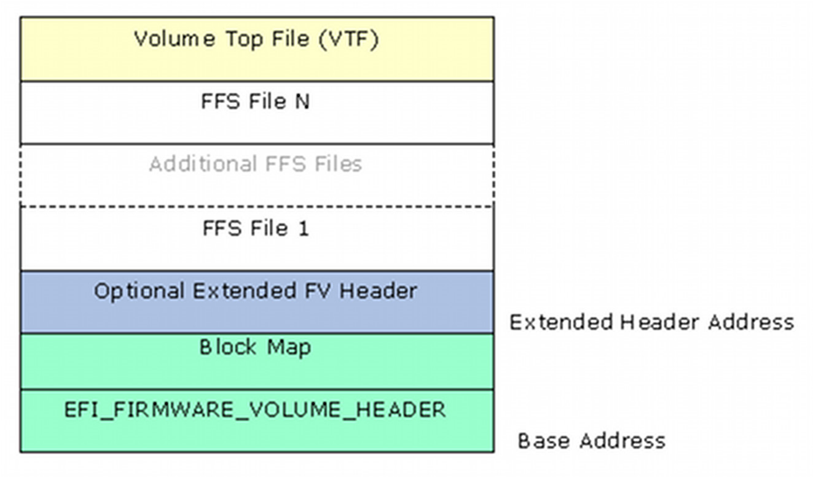
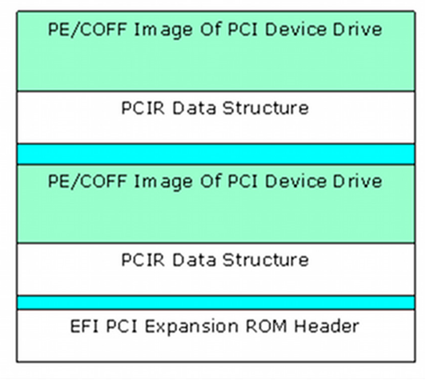
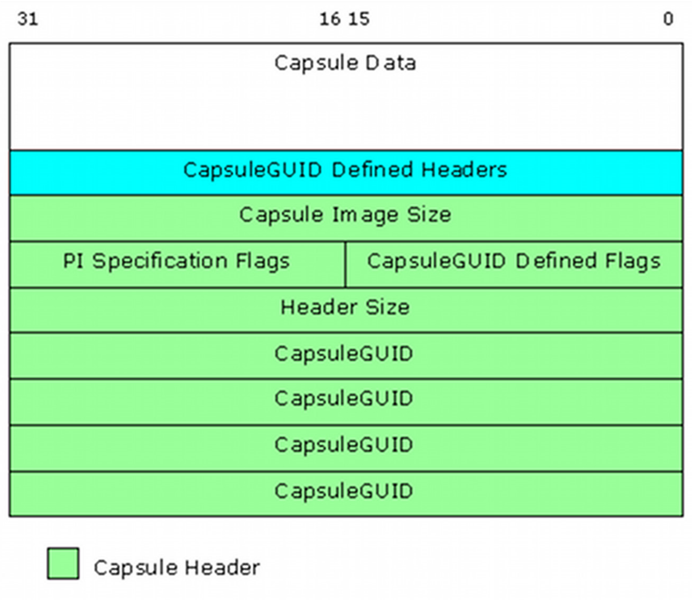

<!--- @file
  2.6 Creating EFI Images

  Copyright (c) 2008-2017, Intel Corporation. All rights reserved.<BR>

  Redistribution and use in source (original document form) and 'compiled'
  forms (converted to PDF, epub, HTML and other formats) with or without
  modification, are permitted provided that the following conditions are met:

  1) Redistributions of source code (original document form) must retain the
     above copyright notice, this list of conditions and the following
     disclaimer as the first lines of this file unmodified.

  2) Redistributions in compiled form (transformed to other DTDs, converted to
     PDF, epub, HTML and other formats) must reproduce the above copyright
     notice, this list of conditions and the following disclaimer in the
     documentation and/or other materials provided with the distribution.

  THIS DOCUMENTATION IS PROVIDED BY TIANOCORE PROJECT "AS IS" AND ANY EXPRESS OR
  IMPLIED WARRANTIES, INCLUDING, BUT NOT LIMITED TO, THE IMPLIED WARRANTIES OF
  MERCHANTABILITY AND FITNESS FOR A PARTICULAR PURPOSE ARE DISCLAIMED. IN NO
  EVENT SHALL TIANOCORE PROJECT  BE LIABLE FOR ANY DIRECT, INDIRECT, INCIDENTAL,
  SPECIAL, EXEMPLARY, OR CONSEQUENTIAL DAMAGES (INCLUDING, BUT NOT LIMITED TO,
  PROCUREMENT OF SUBSTITUTE GOODS OR SERVICES; LOSS OF USE, DATA, OR PROFITS;
  OR BUSINESS INTERRUPTION) HOWEVER CAUSED AND ON ANY THEORY OF LIABILITY,
  WHETHER IN CONTRACT, STRICT LIABILITY, OR TORT (INCLUDING NEGLIGENCE OR
  OTHERWISE) ARISING IN ANY WAY OUT OF THE USE OF THIS DOCUMENTATION, EVEN IF
  ADVISED OF THE POSSIBILITY OF SUCH DAMAGE.

-->

## 2.6 Creating EFI Images

### 2.6.1 Compiling Code

EDK II modules include both libraries, drivers and applications. Library
modules are compiled and linked as static libraries. Drivers and applications
are compiled to object files, then linked with the static libraries they
require. After the static image has been created, the resulting image is run
through the dynamic linker to generate the relocateable binary images (DLL).
All EFI images must be formatted PE32/PE32+/COFF.

**********
**Note:** ELF images created by GCC on UNIX-based systems need additional
processing to convert the image into the PE32+/COFF format.
**********

Since UEFI/PI images are not standard executables, these dynamically linked
(DLL) files must be processed to become UEFI/PI compliant images. This
processing involves replacing the standard header with an EFI header that
reflects the `EFI_SECTION` type. Prior to creating the EFI section files, PEI
Foundation and PEIM images may be processed into either a terse image, or have
the .reloc section removed (for images that will always execute directly from
ROM).

### 2.6.2 Creating a Terse Image

The following is an partial view of the process; omissions may exist.

To create a Terse image:

1. The DOS, PE and/or optional headers must be replaced with a minimal header.
   The TE header will have a signature of "VZ". Per the PE/COFF specification,
   at offset 0x3C in the file is a 32-bit offset (from the start of the file) to
   the PE signature, which always follows the MSDOS stub. The PE signature is
   immediately followed by the COFF file header.

2. After verifying the DOS header's magic number (0x5A4D), the PE signature
   ("PE\0\0")is verified, then obtains the Machine type from the optional
   header's subsystem field.

    * Since this process removes bytes from the file, the number of bytes
      stripped must be calculated based on the location of the PESigOffset
      (0x3C) plus the 4 bytes containing the offset pointer plus the size of
      the Coff header plus the size of any Optional Header (from the Coff
      header's `SizeOfOptionalHeader`).

    * The number of bytes stripped must always be less than 64K bytes. The
      original file size minus the number of bytes stripped is then inserted
      into the TE header's StrippedSize value.

    * The optional header's magic number is used to determine whether the
      Optional Header data structure is IPF (`EFI_OPTIONAL_IMAGE_HEADER64`) or
      non-IPF (`EFI_OPTIONAL_IMAGE_HEADER32`) .

    * Using the correct optional header format, the TE header's
      `AddressOfEntryPoint` is set to the optional header's
      `AddressOfEntryPoint`. Additionally, the `Subsystem` entry from the
      optional header's `Subsystem` entry will be packed into one byte.

    * Additional entries, `BaseOfCode` and `ImageBase` in the TE header come
      from the optional Header. If the optional header's `NumberOfRvaAndSizes`
      is greater than 0, then the relocation data from the optional header
      `DataDirectory[0].VirtualAddress` and `Size` is set based on the content
      of the optional header's `DataDirectory[0]` values.

    * Likewise, if the `NumberOfRvaAndSizes` is greater than 1, then the debug
      data from the optional header's `DataDirectory[1].VirtualAddress` and
      `Size` is set in the TE header's `DataDirectory[1]` entry.

3. As a last step before creating the image, the COFF header specifies the
   value of the `NumberOfSections` in the file which needs to be packed into a
   single byte of the TE header. The number of sections must be less than 255
   for this to succeed.

4. After the header is created, then the rest of the original image - all
   header information stripped is appended to the TE header.

Figure 10 shows the relationship of original image to the TE image.


###### Figure 12 Standard Image to Terse Image Comparison

### 2.6.3 Removing .reloc sections

Removing the relocation section of either a PE or TE image can only be done if
the `.reloc` section is at the end of the file. While most .reloc sections are
fairly small in comparison to the other sections of the files, removing all of
the .reloc sections in combination with using Terse images for the PEI
foundation and PEIMs that do not register for shadow (see UEFI/PI specs) can
shrink a platform image by several hundred bytes.

For a TE image, the file size (`StrippedSize`) is adjusted by subtracting the
length of the `.reloc` section. The `DataDirectory[0] VirtualAddress` is set to
0, as is the `Size` parameter.

Removing the relocation section of a PE image is slightly more complicated. The
PE32+ image header (which contains both the `EFI_IMAGE_DOS_SIGNATURE` - `0x5A4D`
and an `EFI_IMAGE_NT_SIGNATURE` - `0x00004545`) will be modified by setting the
`EFI_IMAGE_FILE_HEADER` Characteristics' `EFI_IMAGE_FILE_RELOCS_STRIPPED` bit.
The IPF header uses a similar data structure to IA32, X64 and EBC data
structures. The naming within the data structures is consistent. Therefore,
regardless of the machine type, both the `SizeOfImage` and
`SizeOfInitializedData` are adjusted by subtracting the length of the `.reloc`
section. If the `NumberOfRvaAndSizes` is greater than the
`EFI_IMAGE_DIRECTORY_ENTRY_BASERELOC`, then the `DataDirectory[0]`
`VirtualAddress` and the `Size` are both set to 0. Finally, the `.reloc`
section's header is modified, setting the `Misc.VirtualSize` and
`SizeOfRawData` to 0.

### 2.6.4 Generating LEAF EFI_SECTION Files

This section provides the overview for generating `EFI SECTION` files.
EFI_SECTION headers must be present on all leaf sections. The EFI Section
header (see above) will be prefixed to the file or data section (`VERSION` and
`USER_INTERFACE` data can be generated "on-the-fly" rather than creating a
separate Unicode file first).

For the files that are PE32 code (`EFI_SECTION_PE32`, `EFI_SECTION_TE` and
`EFI_SECTION_PIC`, the `.text`, `.debug`, `.reloc` and `.data` section headers
(if they exist) are overwritten with the `EFI_IMAGE_SECTION_HEADER`.

The section name (i.e., .`text`) is copied into the `Name` entry, while the
remaining sections are set as follows:

```c
Hdr->Misc.VirtualSize     = Size;
Hdr->VirtualAddress       = Offset;
Hdr->SizeOfRawData        = Size;
Hdr->PointerToRawData     = Offset;
Hdr->PointerToRelocations = 0;
Hdr->PointerToLinenumbers = 0;
Hdr->NumberOfRelocations  = 0;
Hdr->NumberOfLinenumbers  = 0;
Hdr->Characteristics      = Flags;
```

* For a `.text` section, the `Flags` value is a bit-wise OR of
  `EFI_IMAGE_SCN_CNT_CODE`, `EFI_IMAGE_SCN_MEM_EXECUTE` and
  `EFI_IMGE_SCN_MEM_READ` (`0x60000020`).

* For a `.data` section, the Flags value is a bit-wise OR of
  `EFI_IMAGE_SCN_CNT_INITIALIZED_DATA`, `EFI_IMAGE_SCN_MEM_WRITE` and
  `EFI_IMAGE_SCN_MEM_READ` (`0xC0000040`).

* For a .`reloc` section, the Flags value is a bit-wise OR of
  `EFI_IMAGE_SCN_CNT_INITIALIZED_DATA, EFI_IMAGE_SCN_MEM_DISCARDABLE` and
  `EFI_IMAGE_SCN_MEM_READ` (`0x42000040`).

* For a .`debug` section, the Flags value is a bit-wise OR of
  `EFI_IMAGE_SCN_CNT_INITIALIZED_DATA, EFI_IMAGE_SCN_MEM_DISCARDABLE` and
  `EFI_IMAGE_SCN_MEM_READ` (`0x42000040`).

Once these have been modified, the `EFI_COMMON_SECTION_HEADER` will be prefixed
to the file.

Each `EFI_COMMON_SECTION_HEADER` "type" field defines the data that follows.
Table 4 lists the section type value. All EFI section files start with the
`EFI_COMMON_SECTION_HEADER`.


###### Figure 13 EFI Image Files

###### Table 4 Basic EFI SECTION Type Codes

| Section Type                        | Value |
| ----------------------------------- |:-----:|
| `EFI_SECTION_PE32`                  | 0x10  |
| `EFI_SECTION_PIC`                   | 0x11  |
| `EFI_SECTION_TE`                    | 0x12  |
| `EFI_SECTION_VERSION`               | 0x14  |
| `EFI_SECTION_USER_INTERFACE`        | 0x15  |
| `EFI_SECTION_COMPATIBILITY16`       | 0x16  |
| `EFI_SECTION_FIRMWARE_VOLUME_IMAGE` | 0x17  |
| `EFI_SECTION_FREEFORM_SUBTYPE_GUID` | 0x18  |
| `EFI_SECTION_RAW`                   | 0x19  |

The size for these standard sections is defined as a 24-bit unsigned integer
that contains the total size of the section in bytes, including the
`EFI_COMMON_SECTION_HEADER`. For example, a zero-length section has a `Size` of
`4` bytes.

Except for the `EFI_SECTION_VERSION` and the `EFI_SECTION_USER_INTERFACE`, the
format of each section is the `EFI_COMMON_SECTION_HEADER` prefixed to a file
containing data. Refer to the definitions for `EFI_SECTION_VERSION` and
`EFI_SECTION_USER_INTERFACE` in the UEFI specifications for more information.

### 2.6.5 Generating Encapsulation EFI_SECTION Files

This section provides the overview for generating the two Encapsulation
`EFI_SECTION` files. The `EFI_SECTION` header must be present along with
additional header information. The encapsulation EFI Section header will be
prefixed to the file or data section. There are three encapsulation
`EFI_SECTION` types. The first two types listed have extended header
information.

###### Table 5 Encapsulation EFI SECTION Type Codes

| Section Type               | Value |
| -------------------------- |:-----:|
| `EFI_SECTION_COMPRESSION`  | 0x01  |
| `EFI_SECTION_GUID_DEFINED` | 0x02  |
| `EFI_SECTION_DISPOSABLE`   | 0x03  |

A compression section uses the `EFI_SECTION_COMPRESSION` header, while the GUID
defined section uses an `EFI_SECTION_GUID_DEFINED` header.

The size for these sections is defined as a 24-bit unsigned integer that
contains the total size of the section in bytes, including the size of the
header.

For the `EFI_SECTION_COMPRESSION`, the `CompressionType` field must be set to
0x01 for standard compression, or 0x00 if the image is not compressed.

**********
**Note:** In the specification, only `PI_STD` compression is supported for
this section type.
**********

For the `EFI_GUID_DEFINED_SECTION,` which is used for non-standard compression
(see above) the named GUID that defines the section follows the
`EFI_COMMON_SECTION_HEADER`. After this GUID are two additional `UINT16`
parameters, the first is the `DataOffset` which contains the offset in bytes
from the beginning of the common header to the first byte of the data. An
**_Attributes_** parameter is a bit field code which declares specific
characteristics of the section contents.

These headers are prefixed to the data files, which may include the standard
PE32 headers.

### 2.6.6 Generating DEPEX EFI_SECTION Files

This section provides the overview for creating PEI, DXE and SMM DEPEX
sections. The DEPEX grammar is defined in the _PI Specification_ Volume 1,
Dependency Expression Grammar chapter, while the OP codes for the Mnemonic are
defined in Volume 2, DXE Dispatcher chapter. The translation of the mnemonic
and/or GUID involves creating a binary file using postfix notation. The file
does not conform to PE32+/COFF, and no header information is attached prior to
generating the `EFI_SECTION` files. The format of the binary data is 8-bit
aligned, with a single byte per op-code, with op-codes that require a GUID value
(`BEFORE`, `AFTER` and `PUSH`) being followed by 16 bytes to contain the GUID
value. See Table 6 below.

###### Table 6 Dependency Section Type Codes

| Section Type            | Value |
| ----------------------- |:-----:|
| `EFI_SECTION_PEI_DEPEX` | 0x1B  |
| `EFI_SECTION_DXE_DEPEX` | 0x13  |
| `EFI_SECTION_SMM_DEPEX` | 0x1C  |

Once the binary file is created an `EFI_SECTION` file can be created, and the
`EFI_COMMON_SECTION_HEADER` will be prefixed to the file.


###### Figure 14 Depex File

### 2.6.7 Generating Visual Forms (IFR - HII) Files

This section covers the generation of the Human Interface Infrastructure (HII)
format files used for displaying information on the console. While all error
messages from the EFI drivers are written in English, displaying data on the
console - selection and configuration menus - is performed using HII formats.
This permits the user to select an alternate language for these displays.

Strings intended for these displays must be written in Unicode (UCS-2LE)
format, rather than plain ASCII text. The Unicode strings for these forms must
be kept in separate files (.uni extension), or optionally, within C code
(either .c source or .h header) files. Forms, strings, fonts and images are
stored in an HII database encoded to an Internal Forms Representation (IFR) -
with each object and attribute a byte stream.

All HII files are included as part of a driver module's code - the data that
makes up IFR content is compiled into standard object code and linked in to the
driver.

### 2.6.8 Generating EFI FFS Files

This section provides the overview for generating an FFS file. Once the EFI
Section files have been created, they need to be placed within an FFS file. An
FFS file contains an FFS header and one or more section files. The ordering of
the section files within the FFS is not specified by the PI specification, so
sections may appear in any order. The Name of the FFS file, which is placed in
the `FfsFileHeader` data structure is a GUID value with a structure of
`UINT64`, `UINT32`, `UINT32`, `UINT8[8]`.

The alignment of data within the FFS must match the alignment specified for a
given section, so padding may be required between the FFS header and the
section headers. Alignment must be set and padding inserted prior to
calculating the size or performing the Integrity check (checksum on the header
itself and all of the section data).

The size of the FFS, in the `FfsFileHeader.Size` array is computed using the
size of all files, including all pad files, plus the size of the header. The
size value must be less than `0x01000000`(16MB).

The `FfsFileHeader.IntegrityCheck.Checksum.Header` is set to `0`, as are the
`Checksum.File` and `FileHeader.State`, prior to calculating (and setting) the
checksum of the header. If the `FFS_ATTRIB_CHECKSUM` bit is set in the
`FfsFileHeader.Attributes`, then the checksum for the remainder of the FFS
content must be generated and placed in the `Checksum.File` part of the
`FfsFileHead.IntegrityCheck` structure.

The `FfsFileHeader.State` is zeroed, the `EFI_FILE_HEADER_CONSTRUCTION`,
`EFI_FILE_HEADER_VALID` and `EFI_FILE_DATA_VALID` bits are set.

#### 2.6.8.1 FDF file

The build system uses the FDF file to specify construction of the FD, FVs and
FFS files, as well as how to construct the different EFI Sections (what content
is put into each section). Flags for attributes and alignment values are
specified in the FDF file. These values are used to set the bits in FFS Header.
As an example, if multiple sections are specified with different alignment
values, only the maximum value of the alignment is used, and all sections are
aligned to that value. Additionally, the sections are placed into the FFS in
the order they appear in the FDF or specified by the Rules section of the FDF
configuration file. Each driver is put into an FFS of its own. Also, EDK II
expects the ordering of PEIM and DXE FFS files to start with an optional
dependency section, followed by the PE32, user interface and finally the
version sections.

### 2.6.9 APRIORI Files

At most, here can be at most one PEI `APRIORI` and one DXE `APRIORI` file in a
given firmware volume.

The PEI file, named by GUID of `PEI_APRIORI_FILE_NAME_GUID`, will specify the
order of invocation of PEIMs by the PEI foundation. This is a special file, of
the type, `EFI_FV_FILETYPE_FREEFORM` with a single `EFI_SECTION_RAW` and has the
format:

```c
typedef struct {
  EFI_GUID  FileNamesWithinVolume[NumberOfModulesInVolume];
} PEI_APRIORI_FILE_CONTENTS;
```

The DXE file, named by GUID of `DXE_APRIORI_FILE_NAME_GUID`, will specify the
dispatch order of drivers by the DXE foundation. This is a special file, of the
type `EFI_FV_FILETYPE_FREEFORM` with a single `EFI_SECTION_RAW` and has the
same format as the `PEI_APRIORI_FILE_CONTENTS`.

### 2.6.10 Generating EFI Firmware Volume (FV) Files

This section provides the overview for generating an FV file, which contains an
FV header and a sequence of FFS files. FVs are usually implemented so that the
SEC and PEI Foundation are not compressed, while most PEIMs are executed from
ROM (see above). As a result, these images are typically placed in a separate
FV, with post-PEI phase modules placed in one or more FVs that are compressed.
Reference Section 2.6.11 below.

The FV files are combinations of FFS files. For SEC, PEI Foundation and most
PEIMs that execute directly from ROM, will need to have the BaseAddress
re-based to the location of the driver in ROM. There are three different types
of rebase actions. The first action is for the initial Boot drivers, while the
most common is for execute in place (XIP) drivers. Some Runtime drivers may
also need to be re-based. As part of the rebase these execute from ROM drivers
may need to be aligned to the natural alignment of the machine architecture (or
section alignment).

#### 2.6.10.1 Combining FFS files into FV files

The build system uses the Flash Description File (FDF) to describe how to
combine FFS files into different FV files, as well as the layout of the FD
files within an FD description. Each FV definition within the FDF is used to
complete a data structure for constructing the FV. The `FvName` in the
`FV_INFO` structure is used to identify the name of the files that will be
created in the FV directory.

```c
typedef struct {
  BOOLEAN                 BaseAddressSet;
  EFI_PHYSICAL_ADDRESS    BaseAddress;
  EFI_GUID                FvFileSystemGuid;
  BOOLEAN                 FvFileSystemGuidSet;
  CHAR8                   FvExtHeaderFile[_MAX_PATH];
  UINTN                   Size;
  EFI_FVB_ATTRIBUTES      FvAttributes;
  CHAR8                   FvName[_MAX_PATH];
  EFI_FV_BLOCK_MAP_ENTRY  FvBlocks[MAX_NUMBER_OF_FV_BLOCKS];
  CHAR8                   FvFiles[MAX_NUMBER_OF_FILES_IN_FV][_MAX_PATH];
  UINT32                  SizeOfFvFiles[MAX_NUMBER_OF_FILES_IN_FV];
  BOOLEAN                 IsPiFvImage;
  INT8                    ForceRebase;
} FV_INFO;
```

The FV file header (see `EFI_FIRMWARE_VOLUME_HEADER` definition in Section 3)
is constructed using the following information.

The first 16 bytes (`ZeroVector`) are set to zero. The `FvFileSystemGuid` is
assigned a PI Specification defined GUID (`EFI_FIRMWARE_FILE_SYSTEM2_GUID`) that
identifies it as a PI compliant Firmware Volume. The `Signature` is set to
"`_FVH`" and the reserved byte is set to zero. The _PI Specification_ defined
`Revision` is set to `0x02`.

As FFS files are added to the FV, the length of the FFS is added to the
`FvLength` field, such that the final `FvLength` is complete length of the
firmware volume, including the header (and extended header information). Also,
as an FFS file is added to the FV, if the driver executes from ROM, the base
address of the driver will be adjusted (re-based) within the FFS file to the
physical location in ROM (`BaseAddress + offset`).

`Attributes` (defined in the FDF file) are set that define the capabilities and
power-on defaults of this FV. These come from the `FvAttributes` of the FV_INFO
data structure. The `HeaderLength` is set to size of header, including the size
of the `{0,0}` terminated `BlockMap` data array.

The `BlockMap` data array is a mapping of the FFS files - giving the length
(in blocks) and block size for each FFS file in the FV, starting with the first
FFS file. This is an index of the blocks, and does not specify each FFS by name.
If an extended header is required, it must be placed immediately following the
`BlockMap` data array. The `ExtHeaderOffset` is set to the location of the extended
header. Each block will be aligned on the largest value specified by the
`EFI_FVB2_ALIGNMENT` attribute. Note that it is permissible to use variable block
length devices, and as such, each block entry would have the
`BlockMap[index].NumBlocks = 1`, while the `BlockMap[index].BlockLength` would
vary according to the size of the FFS file (plus any padding value needed to
align the next block on a natural boundary).

If the extended header is not included, then the `ExtHeaderOffset` is set to
zero. If an extended header is present, it is followed by zero or more variable
length extension (`EFI_FIRMWARE_VOLUME_EXT_ENTRY`) entries.



###### Figure 15 Firmware Volume Layout

Prior to adding the last FFS file (as specified in the FDF file), the FFS file
must be modified to comply with the Volume Top File specification.

After the last FFS file has been added (so that the `FvLength` is complete),
the `Checksum` field is set to zero and a checksum is calculated on the header
so that a valid header will sum to zero (and placed into the `Checksum` field).

### 2.6.11 Implementing Compression

As stated in earlier sections, images that are executed from ROM may not be
compressed. Images that contain .reloc sections, or that are executed post PEI
phase may be compressed to save space in ROM. For best space savings and
performance, an entire FV (containing all post PEI phase code) can be
compressed, rather than compressing individual drivers. Decompression routines
take a finite amount of time which can be additive - especially on copy
commands - which can result in an unacceptable boot speed. Additionally, most
compression algorithms provide better compression over larger data sets.

The EDK II Build system supports EFI standard compression as well as CRC32
validation within the tools.

For any other form of compression, encoding or signing must be through external
tools. TianoCompress and LZMA tools are provided with the EDK II build system.

The GUIDED encapsulation section method is used to control these additional
tools. By definition (UEFI/PI specifications) a named GUID for a GUIDED
encapsulation section is used to provide information about how to process the
section.

Assigning a GUID to a tool, such as **TianoCompress**, in the `tools_def.txt`
file (refer to Section 5) the **TianoCompress.exe** application can be used to
compress an EFI image - FV, FFS and/or SECTION. The following shows two lines
that are in the `tools_def.txt` file to identify the **TianoCompress** tool.

```
*_MYTOOLS_*_TIANO_PATH = TianoCompress.exe
*_MYTOOLS_*_TIANO_GUID = A31280AD-481E-41B6-95E8-127F4C984779
```

#### 2.6.11.1 GUIDED encapsulation sections

When the Build system encounters a GUIDED encapsulation section in the FDF
file, the GUID is tested against GUIDs registered in the `tools_def.txt` file.
If a match is found, then the executable tool associated in the GUID is
executed on the encapsulated data defined in the FDF file. Since the tool is
not present during a system boot, any optional tool must be able to provide
code that can be used by any decompression, signing or verification drivers
during boot. The following shows the use of the `TianoCompress` GUID in a
sample FDF file for an FVMAIN image that contains all post-PEI modules.

```ini
FILE FV_IMAGE = E76CB2EC-A71A-42e8-8F34-56237870BD12 DEBUG_MYTOOLS_IPF {
  SECTION GUIDED A31280AD-481E-41B6-95E8-127F4C984779 {
    SECTION FV_IMAGE = FVMAIN
  }
}
```

In the example above, the first GUID (starting with `E76CB2EC`) is the EFI Name
for the firmware volume, while the second (following the `SECTION GUIDED`
statement) identifies the tool (**TianoCompress.exe**) that will be used on the
FV section specified within the curly brackets after the GUID.

The EDK II build system requires that all such tools take a minimum of three
options on the command line. The **-e** option specifies that the tool will
encrypt, compress, encode or sign the file specified on the command line. The
**-o** option specifies the name of the output file to be created when using the
**-e** option. A third option, **-d**, is used to decrypt, decompress, decode or
verify the file specified on the command line.

**********
**Note:** Additional options may be included with the tool, however, the build
system only requires these three options.
**********

### 2.6.12 Implementing Encryption or Signing

The same techniques used for implementing custom compression can be used for
tools that are used for signing or encrypting an image.

### 2.6.13 Generating an FD image file

This section provides the overview for generating a platform flash file. When
generating the FD file, the flash device is assumed to be "partitioned" into
different areas, with the content of each added in sequence (with zero filled
padding of any partial blocks to the next specified offset).

#### 2.6.13.1 Data structures

The EDK II build system will create an FD file in the FV output directory, and
using the information in the FDF file, will add all FV files, as well as any
data structures that are specified in the FDF file. Each FV will be added to
the FD file in the order specified by the `[FD]` section at the location
specified. Data structures in the FDF are typically used to initialize the data
area for use by EFI drivers, and as such, may require an FV header to identify
the region (such as NV storage) in Flash.

### 2.6.14 Generating Applications

This section provides an overview to generating UEFI applications which may or
may not be resident in a flash device. Applications fall into three different
types, applications that execute from within a flash image, applications that
execute from the EFI Shell and applications that execute from an Operating
System (accessing UEFI runtime services or need to access UEFI System Table
fields). The build only provides support for UEFI applications that execute
from within the flash image and applications that execute from the EFI Shell.
These statically linked applications cannot make use of OS standard libraries
or headers.

Applications that are executed within the flash image must be stored in an FFS
file, along with the optional version and user interface sections. These
applications are installed as part of the standard shell commands. The only way
to execute a command that is executed within the flash image is to install it
along with the shell commands. Otherwise, they cannot be executed.

Applications that execute from the EFI shell are PE32/COFF applications that
have a modified header, and do not need to be placed within an FFS file. The
.efi file generated by the $(MAKE) stage is capable of being executed from the
shell command prompt.

### 2.6.15 Generating an Option ROM file

This section provides the overview for generating an external PCI Option ROM,
where the driver is on a PCI add-in card. PCI devices that are laid down on a
platform board, rather than on an add-in card (Ethernet, Video, Audio, etc.
devices), will most likely have the driver resident in an FFS/FV/FD with the
device vendor providing the driver code to the board vendor. A PCI Option ROM
is typically discovered during system initialization, and the driver will be
dispatched by the DXE Foundation. PCI Option ROM drivers are constructed from
either EFI files or Binary files or a combination of both.

Most EFI implementations of PCI Option ROMs can use EFI compression for the
driver, so that the ROM image fits into a smaller size device on the PCI add-in
card. These drivers can use NV storage space in the primary on-board flash
device, provided they register the system table data. If the driver is
compressed, the size of the compressed file must be an even multiple of 512
bytes.

**********
**Note:** The maximum size for the driver code is 16MB, so drivers that are
larger than 16MB must be compressed.
**********

The EFI file (PE32+ with modifications to the .data, .text, .reloc and .debug
sections - see Generating Leaf `EFI_SECTION` Files above) will have an
`EFI_PCI_EXPANSION_ROM_HEADER` prefixed to the EFI file (aligned on a 4-byte
boundary). The header structure is defined in the PCI industry standard
specification, and is shown below.

```c
typedef struct {
  UINT16  Signature;
  UINT16  InitializationSize;
  UINT32  EfiSignature;
  UINT16  EfiSubsystem;
  UINT16  EfiMachineType;
  UINT16  CompressionType;
  UINT8   Reserved[8];
  UINT16  EfiImageHeaderOffset;
  UINT16  PcirOffset;
} EFI_PCI_EXPANSION_ROM_HEADER;
```

The `Signature` value of the PCI 3.0 version header is defined as `0xAA55`, and
the `EfiSignature` is defined as `0x0EF1`. The `InitializationSize` is the
number of 512-byte blocks of the driver image plus the size of this header. The
`EfiSubsystem` is set to the value of PE32 Optional Header's Subsystem value,
while the `EfiMachineType` is set to the `EFI_IMAGE_FILE_HEADER`'s Machine
Type. The `CompressionType` field is set to either `0x0000` for no compression,
or `0x0001` for standard EFI compression - no other compression types are
permitted. The reserved bits are typically set to 0 However they may be used.
The `EfiImageHeaderOffset` is set to the size of this header, while the
`PcirOffset` is the offset to the EFI header, (the Option ROM header size plus
any padding bytes to align the driver on its natural alignment boundary).
Additionally, the PCI Data Structure (PCI 3.0 compliant is the default) is also
inserted. The Vendor ID and Device ID are inserted into the PCI Data Structure.
The `ClassCode` and `CodeRevision` are determined from the input file header
information, while the `ImageLength` field is set to the Option ROM Header's
InitializationSize field. All other fields are currently set to 0 by the
reference implementation's EfiRom tool.

PCI device Expansion ROMs may contain code for multiple processor
architectures. This may be implemented in a single physical ROM image, which
can contain as many code images as desired for different system and processor
architectures, Figure 16, below.



###### Figure 16 EFI PCI Expansion Option ROM layout

Each image must start on a 512-byte boundary and must contain the PCI Expansion
ROM header. The starting point of each image depends on the size of previous
images.

The last image in a ROM has a special encoding in the header to identify it as
the last image (_PCI Firmware Specification_, Revision 3.0).

Legacy Option ROM images must be the first image in the ROM image. The
following is a list of the image combinations that may be placed in a PCI
option ROM. This is not an exhaustive list. Instead, it provides what will
likely be the most common PCI option ROM layouts. EFI complaint system firmware
must work with all of these PCI option ROM layouts, plus any other layouts that
are possible within the PCI Specification. The format of a Legacy Option ROM
image is defined in the PCI Specification.

* Legacy Option ROM image
* Legacy Option ROM image + IA-32 EFI driver
* Legacy Option ROM image + Itanium Processor Family EFI driver
* Legacy Option ROM image + IA-32 EFI driver + Itanium Processor Family EFI
  driver
* Legacy Option ROM image + IA-32 EFI driver + x64 EFI driver
* Legacy Option ROM image + EBC Driver
* IA-32 UEFI driver
* Itanium Processor Family EFI driver
* IA-32 UEFI driver + Itanium Processor Family EFI driver
* EBC Driver

It is also possible to place an application in a PCI Option ROM. The exact
mechanism by which applications can be loaded and executed from a PCI Option
ROM is outside the scope of this document.

#### 2.6.15.1 Binary Option ROM code

Pre-existing Binary Option ROM code can also be provided by hardware vendors.
These images are verified to be of the correct format and length. If the length
of the provided image is not an exact 512-byte multiple, padding bytes are
added to ensure the image is an exact multiple of 512 bytes. If this occurs, a
new checksum is calculated and replaces an existing checksum value.

### 2.6.16 Generating Capsule Update Files

This section provides the overview for generating Capsule files. Capsules are
formatted variable length data structures that are passed from runtime back to
the pre boot phases (PEI, DXE, BDS). They are intended to be the major vehicle
for delivering firmware volume changes. Capsules are constructed with a capsule
header and the capsule volume. Content within the capsule volume usually
includes a Firmware Volume as well as a Configuration Results (CR) file. The CR
file is a string of Internal Forms Representation (IFR) name, value pairs as
defined by the Human Interface Infrastructure (HII).

After identifying and creating the Firmware Volume that will be included in the
capsule, the capsule header will be constructed. The header is constructed as
follows.

The `CapsuleGuid` defines the format of the capsule data - including any
optional header information. The format for a capsule is shown in Figure 15.



###### Figure 17 EFI Capsule Layout

2.6.16.1 Capsule generation and content

The EDK II build system provides functionality to generate capsules. The
capsule data content is defined in the FDF file for a given platform
